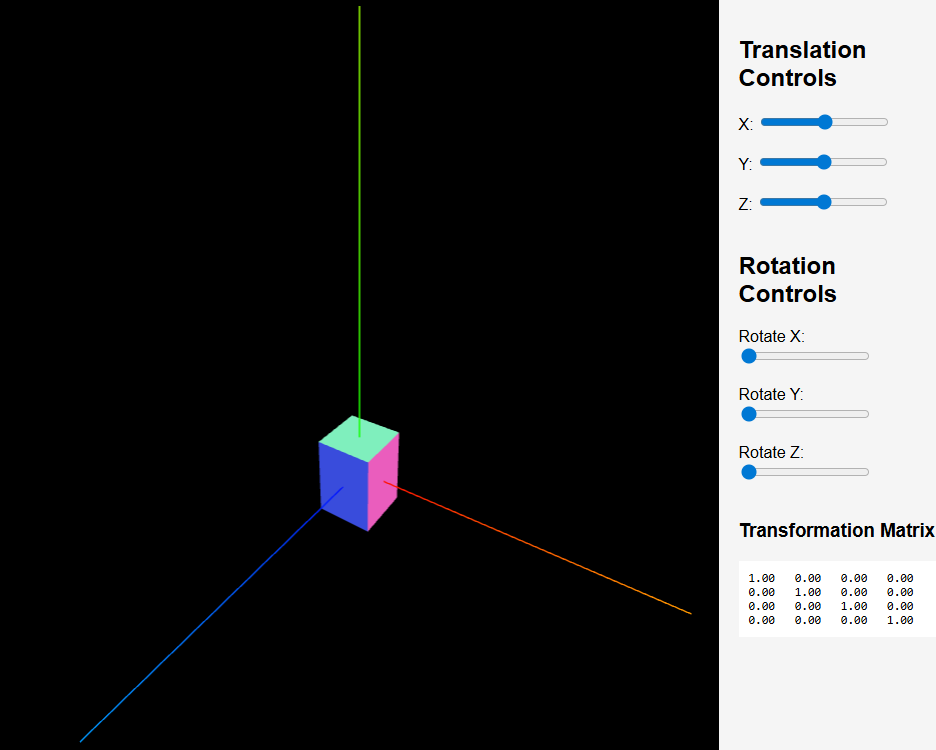
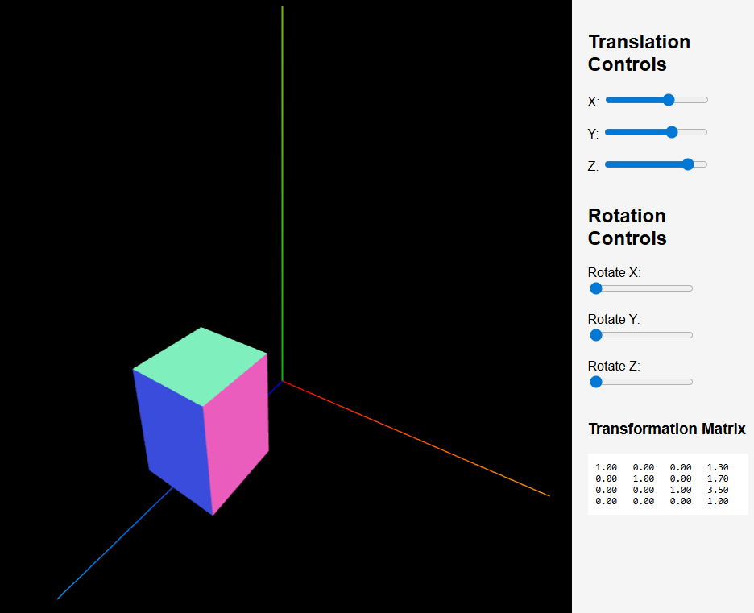
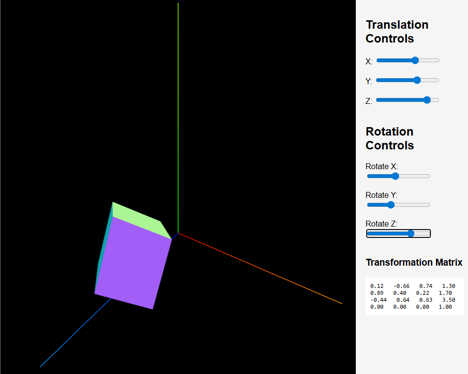
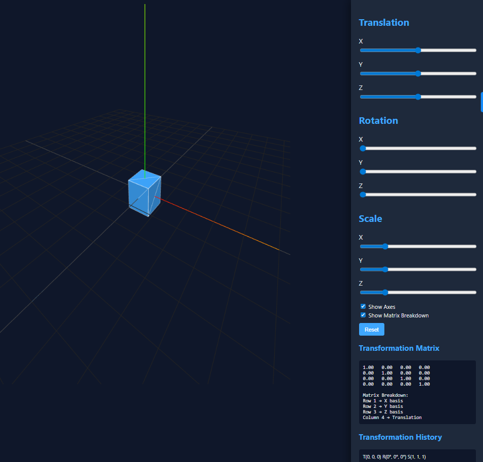

# VR-Based Geometric Transformation Training Environment
### AR-VR-Project-Team_Rankers


---

## Table of Contents
- [Abstract](#abstract)
- [Problem Statement](#problem-statement)
- [Proposed Solution](#proposed-solution)
- [System Architecture](#system-architecture)
- [Technology Stack](#technology-stack)
- [Repository Structure](#repository-structure)
- [Timeline](#timeline)
- [Feasibility & Scope Control](#feasibility--scope-control)
- [Team Members](#team-members)
- [Project Proposal](#project-proposal)

---

## Abstract

Spatial transformations such as translation, rotation, and scaling form the mathematical backbone of robotics, computer graphics, AR/VR systems, and navigation technologies. Despite their importance, these concepts are predominantly taught using two-dimensional diagrams and symbolic matrices. This creates a disconnect between mathematical representation and intuitive spatial understanding.

This project proposes a Virtual Reality-based training environment that enables direct interaction with geometric transformations in immersive 3D space. By visualizing coordinate frames, transformation matrices, and object pose changes in real time, the system aims to strengthen spatial reasoning and reduce training inefficiencies caused by 2D-based instruction models.

---

## Problem Statement

- Spatial transformations are taught primarily through 2D diagrams and symbolic matrices.
- Learners struggle to develop correct 3D intuition.
- Errors occur in coordinate frame alignment and calibration.
- Trial-and-error learning increases training time and operational cost.

There exists a gap between symbolic mathematical learning and embodied spatial interaction.

---

## Proposed Solution

We propose a VR-based interactive training environment that:

- Allows direct manipulation of a 3D object in immersive space
- Implements translation, rotation, and uniform scaling
- Displays transformation matrices in real time
- Visualizes both local and global coordinate frames
- Enables users to compare pre- and post-transformation states

The system replaces passive 2D learning with active 3D spatial interaction.

---

## System Architecture

The system consists of three core modules:

### 1. Interaction Module
- VR controller-based input
- Mode selection: Translation / Rotation / Scaling
- Only one transformation mode active at a time

### 2. Transformation Engine
- Constructs 4x4 homogeneous transformation matrices
- Applies explicit matrix multiplication
- Maintains:
  - Local object coordinates
  - World coordinates
  - Current transformation matrix

### 3. Visualization Module
- Renders local and global coordinate axes
- Displays live transformation matrix in UI panel
- Shows pre- and post-transformation object poses for comparison

*(Architecture diagram will be added in the /assets folder as development progresses.)*

---

## Technology Stack

- **Development Engine:** Unity 3D  
- **Programming Language:** C#  
- **VR Framework:** OpenXR  
- **Target Hardware:** Standalone or PC-tethered VR headset  

---

## Repository Structure

```
.
├── Proposal/
├── Research/
├── Design/
├── Development/
├── Evaluation/
├── BLOGS/
└── Assets/
```

---

## Timeline

| Week | Task | Deliverable |
|------|------|------------|
| 1 | Unity setup & VR integration | Base VR scene with object interaction |
| 2 | Implement transformations & coordinate visualization | Functional translation, rotation, scaling |
| 3 | UI overlay, testing & documentation | Demo-ready prototype |

---

## Feasibility & Scope Control

- Single 3D object
- Three transformations only
- No physics or ML components
- Offline single-user system
- Backup: Desktop 3D version if VR hardware access is limited

---

---

## Web-Based Prototype (Phase 1 Implementation)

To validate our concept before moving into full Unity development, we created a lightweight web-based 3D transformation prototype.

This prototype demonstrates:

- Real-time 3D cube visualization
- Translation along X, Y, Z axes
- Rotation along X, Y, Z axes
- Live transformation matrix updates

This directly supports our goal of improving understanding of geometric transformations by visualizing them in 3D instead of static 2D diagrams.

### Default View


### Translation Example


### Rotation Example


###Updated UI with more features

---


## Team Members

- Saksham Sharma  
- Daivik Pathak  
- Shourya Kapoor  

Under the guidance of **Dr. Raghav B. Venkataramaiyer**

---

## Project Proposal

Full proposal document available here:  
[View Proposal](Proposal/VR_Proposal_Mock_1.pdf)

---

## License

Academic Project – For Educational Use Only
