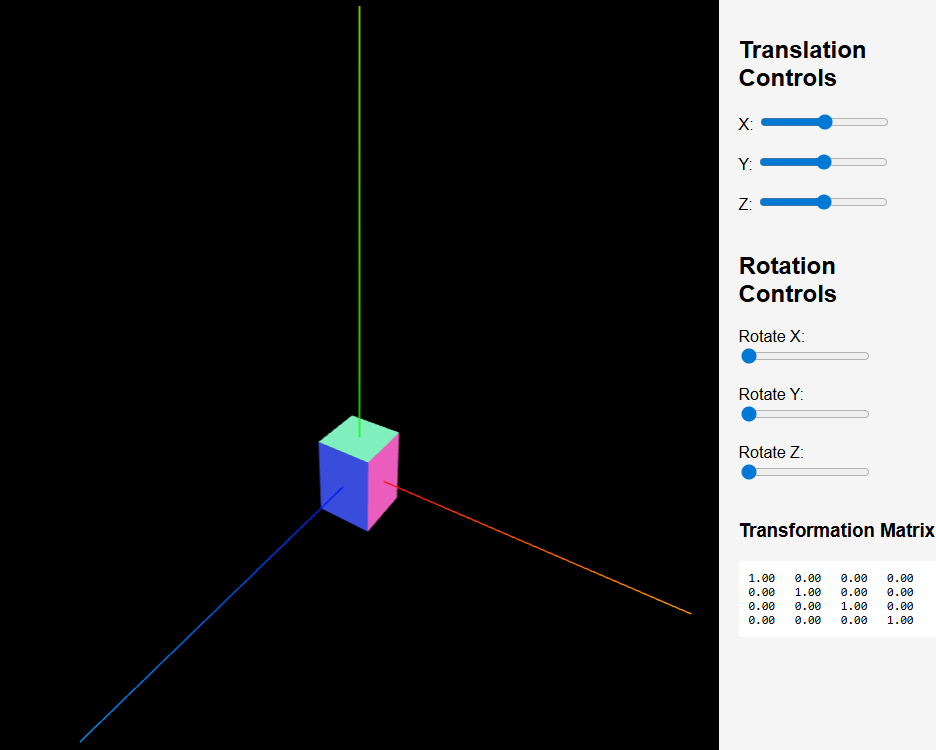
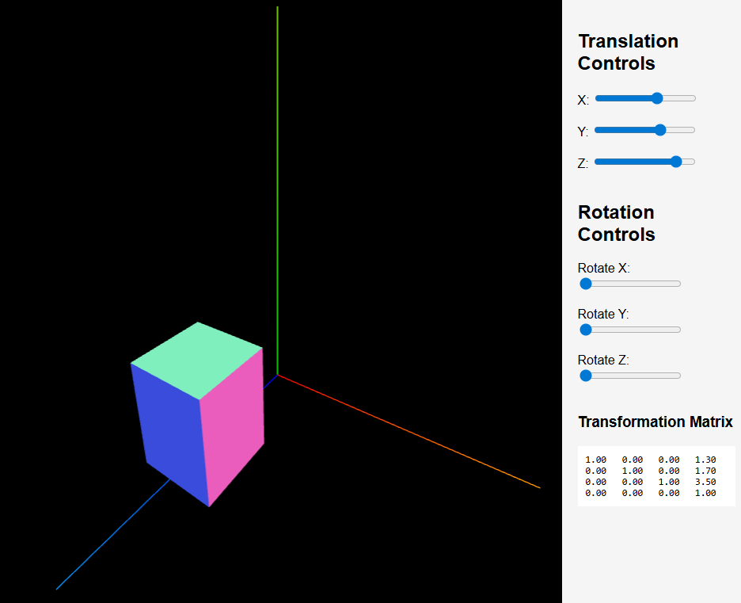
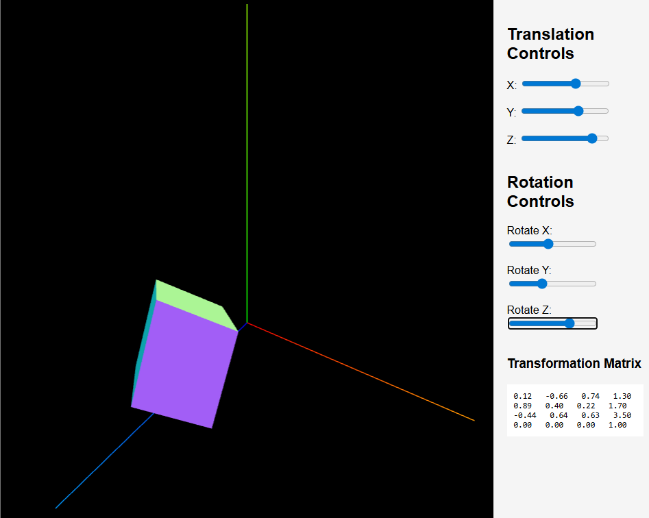
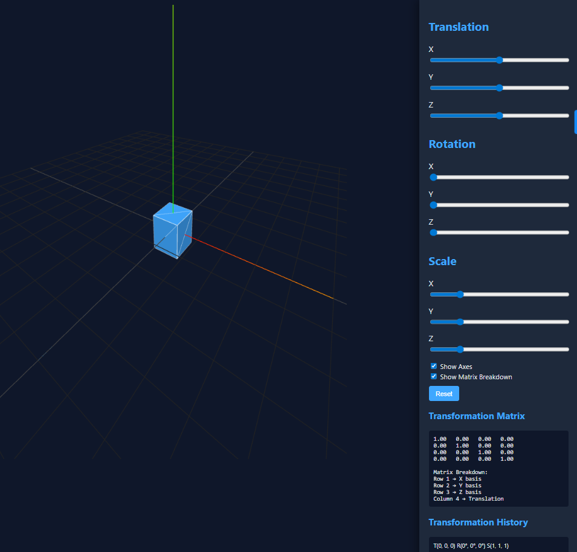
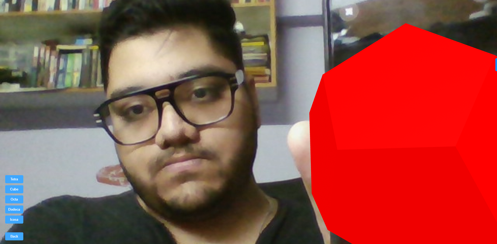
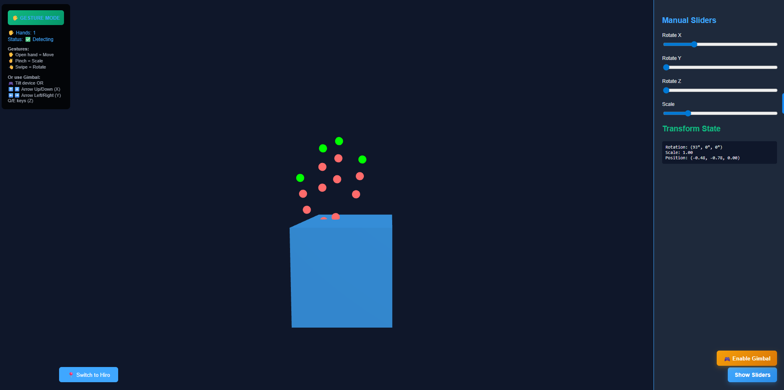
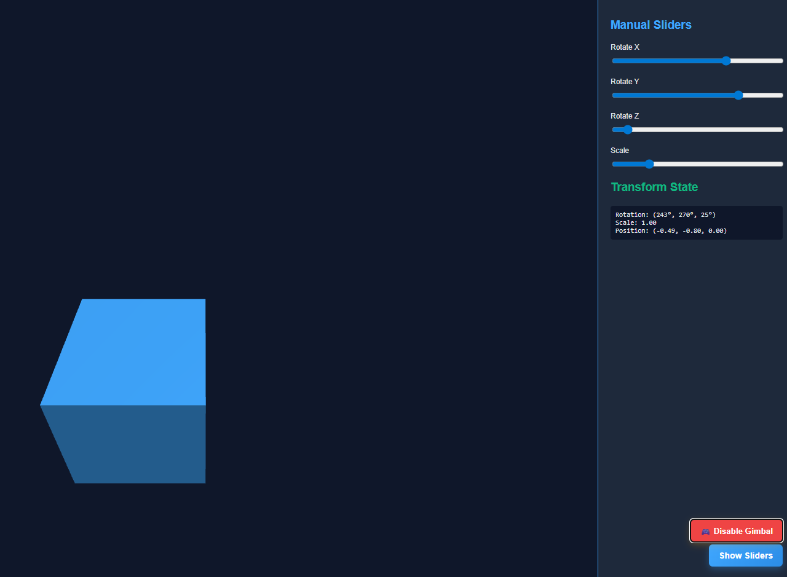
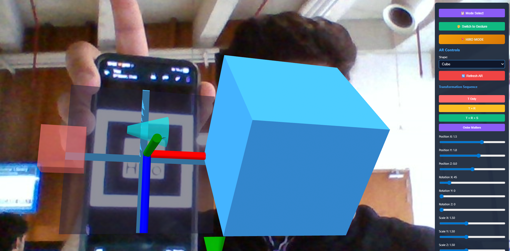
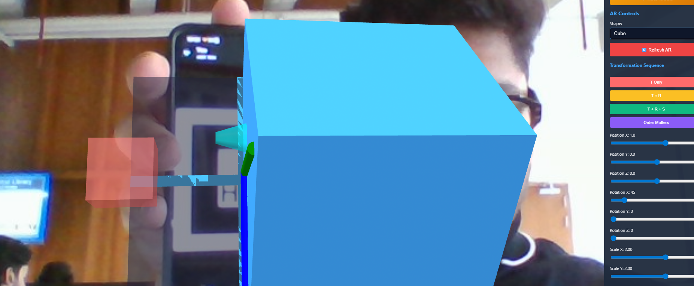

# AR-Based Geometric Transformation Environment  
### AR-VR-Project-Team_Rankers

---

## Table of Contents
- [Abstract](#abstract)
- [Problem Statement](#problem-statement)
- [Proposed Solution](#proposed-solution)
- [System Overview](#system-overview)
- [Technology Stack](#technology-stack)
- [Web-Based Prototype (Phase 2)](#web-based-prototype-phase-2)
- [AR Integration](#ar-integration)
- [Features](#features)
- [Feasibility & Scope Control](#feasibility--scope-control)
- [Timeline](#timeline)
- [Repository Structure](#repository-structure)
- [Team Members](#team-members)

---

## Abstract

Geometric transformations such as translation, rotation, and scaling are fundamental to fields like computer graphics, robotics, and AR/VR systems. However, these concepts are often taught using static 2D representations, making it difficult to build intuitive 3D understanding.

This project presents a web-based interactive environment that enables real-time visualization and manipulation of 3D objects. The system is further enhanced with marker-based Augmented Reality (AR), allowing users to preview and transfer objects into an interactive transformation space.

---

## Problem Statement

- Transformation concepts are taught using static 2D diagrams  
- Lack of intuitive understanding of 3D spatial behavior  
- Difficulty visualizing object orientation and coordinate changes  
- Limited interactive learning tools  

---

## Proposed Solution

We developed an interactive 3D transformation system that:

- Allows real-time manipulation of objects in 3D space  
- Supports translation, rotation, and scaling  
- Displays transformation matrices dynamically  
- Extends beyond a cube to include all Platonic solids  
- Integrates AR-based object preview and selection  

---

## System Overview

### 1. Transformation Environment
- Built using Three.js  
- Displays 3D objects in a controllable scene  
- Supports:
  - Translation (X, Y, Z)  
  - Rotation (X, Y, Z)  
  - Scaling  
- Includes transformation breakdown and history  

---

### 2. AR Interaction Module
- Built using AR.js  
- Uses Hiro marker for detection  
- Enables object preview and selection in AR  

---

## Technology Stack

- **3D Rendering:** Three.js  
- **AR Framework:** AR.js  
- **Languages:** HTML, CSS, JavaScript  
- **Deployment:** Netlify  

---

## Web-Based Prototype (Phase 2)

This phase extends the initial cube-based prototype into a system supporting multiple geometries and AR interaction.

### Supported Platonic Solids
- Tetrahedron  
- Cube (Hexahedron)  
- Octahedron  
- Dodecahedron  
- Icosahedron  

All solids follow the same transformation pipeline, demonstrating consistency across different geometries.

---

### Default View

### Translation Example

### Rotation Example

### Updated UI with more features

### AR Interaction View

### Gesture Controls

### Gimbal Implementation

### Transformation Sequences for matrix Multiplication

---

## AR Integration

### Workflow
1. User opens camera mode  
2. Hiro marker is detected  
3. Selected Platonic solid is displayed in AR  
4. User confirms selection  
5. Object is transferred to main scene  
6. Transformations are applied normally
7. Hand Tracking that visually shows the rotation and movement
8. Gimbal implementation (partial) to make use of accelerometer

---

## Features

- Real-time 3D transformations  
- Support for all Platonic solids  
- Dynamic object switching  
- Marker-based AR preview  
- Transformation matrix visualization  
- Reset to default cube  
- Transformation history tracking  

---

## Feasibility & Scope Control

- Limited to basic 3D transformations (translation, rotation, scaling)  
- Single marker-based AR system (Hiro marker)  
- No AI/ML-based detection  
- Web-based implementation for accessibility  
- Focus on conceptual understanding rather than complex rendering  

---

## Timeline

| Phase | Task | Outcome |
|------|------|--------|
| Phase 1 | Basic 3D cube transformations | Functional transformation system |
| Phase 2 | Platonic solids + AR integration | Interactive AR-enabled prototype |
| Phase 3 | Testing & refinement | Demo-ready system |

---

## Repository Structure
.
├── Proposal/
├── Research/
├── Design/
├── Development/
│ └── web_prototype/
├── Evaluation/
├── BLOGS/
└── Assets/

---

## Team Members

- Saksham Sharma  
- Daivik Pathak  
- Shourya Kapoor  

Under the guidance of **Dr. Raghav B. Venkataramaiyer**

---

## License

Academic Project – For Educational Use Only
